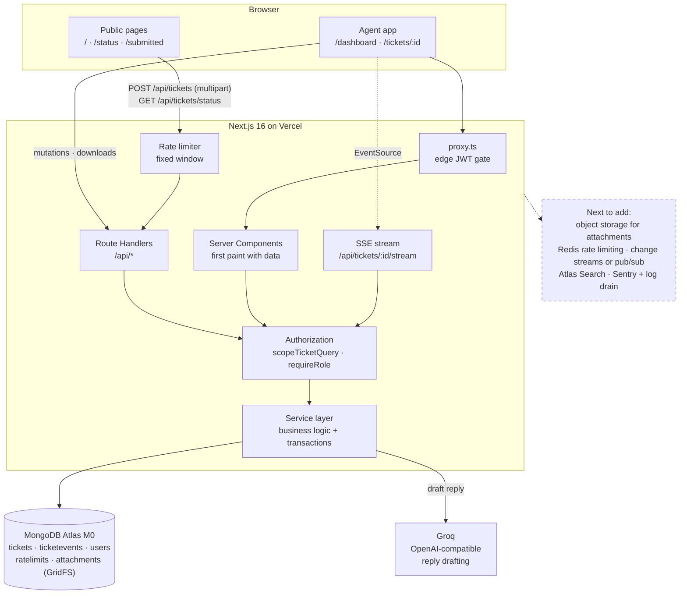

# Architecture

XRise Mini Helpdesk — a single Next.js 16 application serving two audiences from
one ticket store: anonymous customers who submit and track tickets, and
authenticated agents who triage and respond.

## System diagram



Solid nodes exist today, including the SSE stream, GridFS attachment storage and
the LLM provider. The dashed node is what I would add next, in that order.

## Data model

Four collections. Ticket documents stay small and mutable; history is
append-only and lives beside them.

**`tickets`** — `ticketId` (public, random), customer name/email, subject, body,
`status`, `priority`, `assigneeId` (nullable), `lastAgentReply` (denormalised),
timestamps.

**`attachments.files` / `attachments.chunks`** — GridFS buckets holding ticket
attachments, with `metadata.ticketId` linking each file to its ticket and
`metadata.contentType` carrying the validated MIME type.

**`ticketevents`** — `ticketId`, `type` (`created` | `replied` |
`status_changed` | `reassigned`), `actor` `{ id, name, kind }`, `payload`,
`createdAt`. Append-only; never updated or deleted.

**`users`** — agents and admins: `email`, `passwordHash` (bcrypt cost 12,
`select: false`), `name`, `role`.

**`ratelimits`** — `key`, `count`, `expiresAt`.

### Indexes

Every index exists to serve a query the application actually runs. Compound keys
follow Equality → Sort → Range ordering.

| Collection | Index | Query it serves |
|---|---|---|
| tickets | `{ ticketId: 1 }` unique | Public status check; email is a predicate on the same document |
| tickets | `{ assigneeId, status, priority, createdAt: -1 }` | Agent dashboard — scope first, then filters, then sort |
| tickets | `{ status, priority, createdAt: -1 }` | Admin dashboard — same without the assignee prefix |
| tickets | `{ createdAt: -1 }` | Unfiltered admin list; a compound index cannot serve a bare sort whose key is not a prefix |
| tickets | `{ subject: text, body: text }` weighted 3:1 | Server-side search |
| ticketevents | `{ ticketId: 1, createdAt: 1 }` | One ticket's timeline, oldest first — the only query this collection serves |
| users | `{ email: 1 }` unique | Login lookup |
| ratelimits | `{ key: 1 }` unique, `{ expiresAt: 1 }` TTL 0 | Window counter; Mongo reaps expired windows with no cleanup job |

Two integration tests run `.explain()` against the dashboard query and assert the
plan contains `IXSCAN` and not `COLLSCAN`, so these indexes are provably used
rather than merely declared.

### Schema tradeoff: normalised timeline, denormalised latest reply

Timeline events live in their own collection rather than embedded in the ticket.
Embedding is tempting — one read serves the detail view and updates are
naturally atomic — but event history is unbounded. A long-running ticket would
grow toward the 16MB document ceiling, every append would rewrite the whole
document, and events could not be paginated independently of the ticket.

Normalising costs something specific, though: the public status check would need
a second query purely to find the latest agent reply, on the only
unauthenticated, rate-limit-exposed endpoint in the system. So `lastAgentReply`
is copied back onto the ticket and written in the **same transaction** as the
`replied` event.

The tradeoff is duplicated derived data that could drift if a write partially
failed. That risk is bounded by the transaction, and a test forces the timeline
write to fail and asserts the ticket does not survive on its own. In exchange,
the hottest public path is a single indexed read.

## Authentication and authorization

### Proving a request is legitimate

Agents authenticate with email and password. Passwords are bcrypt hashes at cost
12, never selected by default and never returned. A failed login and an unknown
address produce byte-identical responses — same code, message and status — and
an unknown address still burns a bcrypt comparison, so neither the body nor the
response time can be used to enumerate accounts.

On success the server signs a JWT (HS256, 8-hour expiry, issuer and audience
pinned) and sets it in an **httpOnly, SameSite=Lax, Secure** cookie. httpOnly
rather than `localStorage` means a successful XSS still cannot read the token.
`jose` is used rather than `jsonwebtoken` because it is built on Web Crypto and
therefore runs in the edge runtime. Verification pins `algorithms: ['HS256']`,
which closes the algorithm-confusion attack, and rejects any token whose claims
do not match the expected shape — including a validly signed token carrying an
unknown role.

### Preventing cross-agent access

The rule is that an admin sees every ticket and an agent sees only tickets
assigned to them. **This is a data-access rule, not a UI rule**, and it is
enforced in exactly one place:

```ts
function scopeTicketQuery(user: AuthUser) {
  return user.role === 'admin' ? {} : { assigneeId: new ObjectId(user.sub) };
}
```

Every ticket read and write composes this filter — list, **pagination count**,
search, detail-by-id, reply, status change. The count matters as much as the
rows: scoping the returned rows while counting the whole collection leaks the
existence of tickets the agent cannot see, and there is a dedicated test for it.

The filter is always spread **last**, so a caller-supplied filter cannot widen
it. An agent requesting `?assigneeId=<another agent>` gets their own tickets
back, not an error and not someone else's data.

Requesting a ticket outside your scope returns **404, not 403**, deliberately
identical to a ticket that does not exist. A 403 would confirm the id is real
and turn the detail endpoint into an oracle for probing the ticket space. The
same reasoning applies to the public status check, where a wrong email and a
nonexistent ticket return the same message.

Defence is layered. `proxy.ts` (Next.js 16's replacement for `middleware`)
rejects unauthenticated page requests at the edge, but it is a fast reject and
**never the security boundary** — Next documents that proxy may run at a CDN, so
every Route Handler independently re-derives the session and every service
re-applies its scope. Role gates (`requireRole('admin')` on reassignment) sit in
the handler *and* the service.

Proxy guards pages only, not `/api/*`, because the API mixes public and
protected routes on one path: `POST /api/tickets` is the public submission form
while `GET /api/tickets` is the agent list. A path-prefix rule there would
either block the public form or wave the agent list through.

### Other controls

Rate limiting on all three unauthenticated entry points, consumed **before**
validation so malformed floods also cost budget. Zod validates every request
body and query string, with `limit` clamped at 50 so no caller can request a
full scan. Mongoose `strictQuery` plus Zod parsing blocks operator injection.
Errors return one consistent shape with a `requestId`; stack traces are logged,
never serialised. CORS is closed by default — the app is same-origin, so no
`Access-Control-Allow-Origin` header is emitted at all.

## Scaling

**1,000 tenants / 1M tickets.** The application is single-tenant today, and that
is what breaks first: there is no tenant discriminator anywhere in the schema,
so 1,000 tenants would either mean 1,000 deployments or a migration adding
`tenantId` to every document, every index as its leading field, and — critically
— to `scopeTicketQuery`, which is the one place that would have to change for
isolation to hold. At 1M tickets the indexes still serve the dashboard, but two
things degrade: `skip`/`limit` pagination gets linearly slower with depth, since
Mongo walks and discards skipped documents, and the single text index becomes
large and write-expensive. I would move to cursor (keyset) pagination on
`{ createdAt, _id }`, move search to Atlas Search, and — before either — check
whether the M0 tier's storage and connection ceilings were reached first, which
at 1M tickets they would be.

**100 concurrent agents.** Serverless connection management breaks first. Each
warm lambda holds its own Mongo pool, so concurrency multiplies connections
rather than sharing them, and M0 caps at 500. The cached-connection-per-container
pattern already in `db/client.ts` mitigates this, but the real fix is a proxy
that pools centrally. Second is the rate limiter: every request performs a
`findOneAndUpdate` against `ratelimits`, so it adds a write to the hot path of
every public request. At that level of traffic I would move it to Redis
(Upstash), where the same fixed-window logic costs a single atomic `INCR`.
Neither limit is near at take-home scale, and both have well-understood fixes.

**What I would change.** In order: cursor pagination, Redis-backed rate limiting,
Atlas Search, then a connection proxy. None require touching the authorization
model, which is the point of having concentrated it in one function.

## Observability

**Log** structured JSON (pino) with one record per request carrying method, path,
status, duration and a `requestId` that also appears in the client's error body,
so a user-reported failure maps to an exact server trace. Redaction is
configured for `password`, `passwordHash`, `token`, `authorization` and `cookie`,
and connection strings are scrubbed of credentials before any driver error is
logged — Mongo errors quote the URI they failed on. Authorization denials should
be logged at warn with the actor and the target, since a spike in cross-scope
404s is an early signal of probing.

**Measure** p50/p95/p99 latency per route, error rate by code, rate-limit
rejections per endpoint, Mongo connection-pool saturation and query times,
login failure rate, and ticket lifecycle metrics — time to first reply, time to
resolution, and open tickets by age.

**Alert** on 5xx rate above a small baseline, p95 latency regression, any spike
in `FORBIDDEN`/`NOT_FOUND` on ticket detail (probing), login failure spikes
(credential stuffing), connection-pool exhaustion, and rate-limit rejections
rising sharply on the public endpoints. Health of the Mongo connection itself
deserves a synthetic check, since a failed connection currently surfaces to users
as a generic 500.

## Top 3 for week 2–3

1. **Move attachments to object storage.** They currently live in GridFS, which
   avoided a second service but consumes cluster storage — a real constraint on
   Atlas M0's 512MB. S3-compatible storage with presigned uploads takes the file
   bytes off the database and off the application's request path entirely, and
   adds room for virus scanning before an agent opens anything.

2. **Replace the SSE poll with change streams or a pub/sub broker.** The stream
   currently polls every three seconds, which is one query per watching agent per
   interval. That is fine for a handful of agents and wasteful at a hundred.
   MongoDB change streams on a long-lived host, or Pusher/Ably on serverless,
   removes the polling entirely and cuts update latency to near zero.

3. **Cursor pagination and Atlas Search.** `skip`/`limit` degrades with depth and
   the `$text` index matches only whole stemmed words, so `data` never finds
   `database`. Both are invisible at seed scale and both bite at 1M tickets.

Close behind: a CSRF double-submit token to complement `SameSite=Lax`, and
audit-log retention with export.
